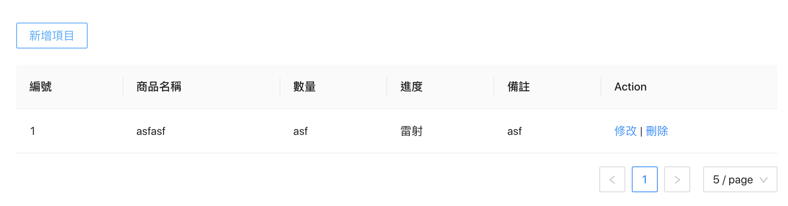

# Ant design

## 範例

1.包含分頁與新增、修改、刪除的表格



```javascript
import React, { useState } from "react";
import { Table, Button, DatePicker, Modal, Select, Form } from "antd";
import Footer from "../../component/Footer";
import { Input } from "antd";
import { UserOutlined } from "@ant-design/icons";
const { Option } = Select;

const columns = [
  {
    title: "編號",
    dataIndex: "key",
  },
  {
    title: "商品名稱",
    dataIndex: "name",
  },
  {
    title: "數量",
    dataIndex: "count",
  },
  {
    title: "進度",
    dataIndex: "progress",
  },
  {
    title: "備註",
    dataIndex: "comment",
  },
  {
    title: "Action",
    dataIndex: "",
    key: "x",
    render: (text, record) => (
      <>
        <span
          onClick={(e) => {
            console.log('edit', record.key, e);
          }}
        >
          <a>修改</a>
        </span>
        <span> | </span>
        <span
          onClick={(e) => {
            console.log('delete',record.key, e);
          }}
        >
          <a>刪除</a>
        </span>
      </>
    ),
  },
];

function CreateOrder() {
  const [itemList, setItemList] = useState([]);
  const [visible, setVisible] = useState(false);

  const showModal = () => {
    setVisible(true);
  };

  return (
    <div
      style={{ paddingLeft: "20px", paddingRight: "20px", paddingTop: "20px" }}
    >
      <div>
        <Button onClick={showModal}>新增項目</Button>
        <div style={{ height: "20px" }}></div>
        <Table
          pagination={{
            total: itemList.length,
            defaultPageSize: 5,
            showSizeChanger: true,
          }}
          columns={columns}
          dataSource={itemList}
        />
      </div>
      <Footer />

      <Modal
        title="新增項目"
        destroyOnClose={true}
        visible={visible}
        onCancel={() => setVisible(false)}
        footer={null}
      >
        <Form
          name="basic"
          onFinish={(values) => {
            const newValue = {
              ...values,
              key: itemList[0]
                ? (parseInt(itemList[itemList.length - 1].key) + 1).toString()
                : "1",
            };
            setItemList([...itemList, newValue]);
          }}
          onFinishFailed={() => {}}
        >
          <Form.Item
            label="商品名稱"
            name="name"
            rules={[{ required: true, message: "請輸入商品名稱" }]}
          >
            <Input placeholder="商品名稱"></Input>
          </Form.Item>

          <Form.Item
            label="數量"
            name="count"
            rules={[{ required: true, message: "請輸入數量" }]}
          >
            <Input placeholder="數量"></Input>
          </Form.Item>

          <Form.Item
            label="進度"
            name="progress"
            rules={[{ required: true, message: "請選擇進度" }]}
          >
            <Select style={{ width: "100%" }} onChange={() => {}}>
              <Option value="製圖">製圖</Option>
              <Option value="雷射">雷射</Option>
              <Option value="焊接">焊接</Option>
              <Option value="折彎">折彎</Option>
              <Option value="烤漆">烤漆</Option>
              <Option value="鍍鈦">鍍鈦</Option>
              <Option value="其他加工">其他加工</Option>
              <Option value="包裝">包裝</Option>
              <Option value="組立">組立</Option>
              <Option value="入庫">入庫</Option>
            </Select>
          </Form.Item>

          <Form.Item label="備註" name="comment">
            <Input placeholder="備註"></Input>
          </Form.Item>
          <Form.Item>
            <Button type="primary" htmlType="submit">
              送出
            </Button>
          </Form.Item>
        </Form>
      </Modal>
    </div>
  );
}

export default CreateOrder;

```

## 設定表單 input value

```text
  const [form] = Form.useForm();
  ．．．
    form.setFieldsValue({
      username: 'Mario',
    });
```

然後

```text
    <Form
        {...layout}
        name="basic"
        initialValues={{
            remember: true,
        }}
        form={form} // Add this!
    >
```

[https://stackoverflow.com/a/62855456/4622645](https://stackoverflow.com/a/62855456/4622645)

