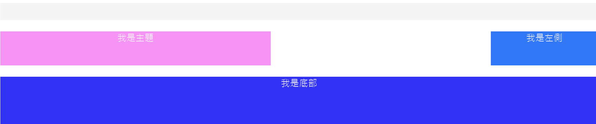

# CSS Grid 教學

## CSS Grid 教學

[https://css-tricks.com/snippets/css/complete-guide-grid/](https://css-tricks.com/snippets/css/complete-guide-grid/)

CSS Grid 為一個 CSS 的 layout 方法，2-dimension 的排版方式。

(有兩個方式寫grid 以下分別說明)

## 寫法1

以此為範例

[https://codepen.io/pen/?editors=1100](https://codepen.io/pen/?editors=1100)

步驟1: 寫 grid-template-columns 與 grid-template-rows 用來寫好這個container是如何分割

步驟2:寫grid-template-areas 幫每個分割的區塊命名

步驟3:可以幫每個區塊與區塊間加上gap

```css
.grid-container {
  height: 100vh;
  display: grid;
  grid-template-columns: 0.25fr 0.25fr 0.25fr 0.25fr;
  grid-template-rows: 30px 60px 100px;
  grid-template-areas: "header header header header"
                       "main main . sidebar"
                       "footer footer footer footer";
  grid-column-gap: 100px;
  grid-row-gap: 20px;
}
```

```markup
<div class="grid-container">
  <div class="grid-item header">
    <div>我是標題</div>
  </div>
  <div class="grid-item main">
    <div>我是主題</div>
  </div>
  <div class="grid-item sidebar">
    <div>我是左側</div>
  </div>
  <div class="grid-item footer">
    <div>我是底部</div>
  </div>
</div>
```

最後在把每個區塊寫上

並用 grid-area 屬性填上剛才 grid-template-areas 分配的名稱

```css
.grid-item div {
  text-align: center;
}

.header {
  background-color: black;
  grid-area: header;
}

.main {
  background-color: green;
  grid-area: main;
}

.sidebar {
  background-color: orange;
  grid-area: sidebar;
}

.footer {
  background-color: yellow;
  grid-area: footer;
}
```



## #寫法2

直接分配每個部分要從區塊第幾個開始到第幾個結束

```
.header {
  background-color: black;
  grid-column-start: 1;
  grid-column-end: end;
  grid-row-start: 1;
  grid-row-end: 2;
}
```

## #其他align 的方法

給container

```
 justify-items
 align-items
 justify-content
```

給child

```
justify-self
align-self
```

## grid-template-row 與 grid-auto-row 區別

auto-row 或 auto-column 後面都只能接受一個數值:

```
grid-auto-rows: auto;
```

但 template-row 與 template-column 接受多個

```
grid-template-columns: 1fr 1fr 1fr;
```

> 通常知道有多少個元素時會用 template- 而不確定元素數量時使用 auto-
