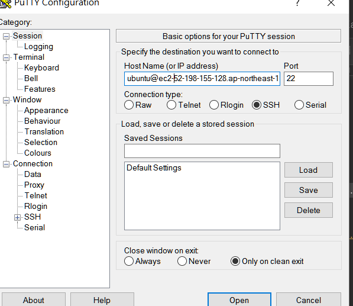
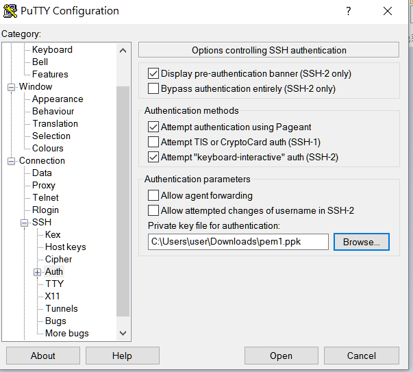

# 遠端連線

1.使用ssh

ex:

```text
ssh -i C:\Users\yicheng\Desktop/pem1.pem  ubuntu@ec2-52-198-111-128.ap-northeast-1.compute.amazonaws.com
```

2.使用putty

\(如果是aws ec2產生的private key 要先用putty keygen轉格式\)



然後找到左方的SSH &gt; AUTH 加上剛才轉好的金鑰



2.VNC server

