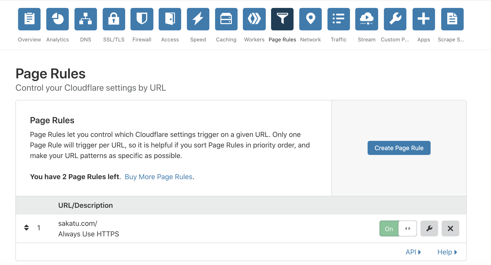

# 使用cloudflare

## 介紹

他會幫你在你的網站server前再加一道防護，你可以去你的DNS provider中把ns(name server)改成cloudflare提供的兩個位置即可

> 在Cloudflare找到如下的兩個位置的Name Server

Godaddy畫面如下，加入剛才的兩個位置

加完了以後再回到cloudflare點選右邊藍色的Recheck按鈕即可。

加上A紀錄。


之後要等一小時左右，讓NameServer 生效。

## 使用

照著官網步驟即可，但注意在搜尋DNS設定時可能有些不會找到，要自己加上去

## 設定SSL

> 產生 origin certificate 即可，client certificate 可以不用，然後如果 server 是放在自己 host 的就選擇 full，放在 github 之類的選擇 Flexible

[https://support.cloudflare.com/hc/en-us/articles/200170416-What-do-the-SSL-options-mean-](https://support.cloudflare.com/hc/en-us/articles/200170416-What-do-the-SSL-options-mean-)

進入dashboard後點選Crypto之後ssl有三個選項

```
Full   會自動偵測你的主機server內是否有設定SSL證書,自行簽發的即可

Full(Strict)  必須要有合格機構簽發的SSL證書才能

Flexible  不用證書它會自動幫你上https
```

> 以nginx為例，如果使用Full則必須要加上以下才可以，不然監聽443 port時會無法存取網頁。
>
> 其中pem與key是從Crypto頁下方的`Origin Certificates` 產生。
>
> ```
> ssl on;
> ssl_certificate /usr/test/c.pem;
> ssl_certificate_key /usr/test/c.key;
> ```

如果用Flexible策略則在nginx不用加入以上。

官網說明

```
Flexible SSL: There is an encrypted connection between your website visitors and Cloudflare, but not from Cloudflare to your server.
You do not need an SSL certificate on your server
Visitors will see the SSL lock icon in their browser

Full SSL: Encrypts the connection between your website visitors and Cloudflare, and from Cloudflare to your server. The difference between Full and Full (Strict) is that Full (Strict) checks for a valid certificate on your origin server, whereas Full checks for any certificate.
You will need to have an SSL certificate on your server. However, Cloudflare will not attempt to validate the certificate (certificates may be self-signed)
Visitors will see the SSL lock icon in their browser

Full SSL (strict): Encrypts the connection between your website visitors and Cloudflare, and from Cloudflare to your server.
You will need to have a valid SSL certificate installed on your server signed by a publicly trusted certificate authority which has not expired and contains the domain name for the request (hostname).
Visitors will see the SSL lock icon in their browser
```

> 配置後要等一下才會生效(可能到幾個小時)，如果是讓github page 自訂域名後用https，設定要選Flexible

## 用 Full SSL

> 在下圖產生 key 和 pem。private key 只有第一次產生時會顯示。

之後到 nginx 設定如下：

```
server {
  server_name test.com;
  listen 443;
  ssl on;
  ssl_certificate /usr/share/nginx/sslcrt/cert.pem;
  ssl_certificate_key /usr/share/nginx/sslcrt/private.key;
}
```

## 用 Flexible SSL

如果用nginx，則在nginx設置好 80 port 後在https網址即可看到

因為 flexible 是由 cloudflare 設置 client 與 cloudflare 間的 https 連線，而 cloudflare 與 api server 或 web server 之間仍是走 http，所以可以不用在 server 安裝證書，且 nginx 監聽 80 port 即可。

### 包含後端與前端

cloudflare 設置


Nginx 範例 config

```javascript
# Default server block for domain.com
server {
    listen 80;
    server_name domain.com www.domain.com;

    # Your site configuration goes here
    location / {
        # Your site settings go here
    }
}

# Server block for api.domain.com
server {
    listen 80;
    server_name api.domain.com;

    # Proxy settings to route requests to port 8111
    location / {
        proxy_pass http://localhost:8111/;
        proxy_set_header Host $host;
        proxy_set_header X-Real-IP $remote_addr;
        proxy_set_header X-Forwarded-For $proxy_add_x_forwarded_for;
    }
}
```

### 產生 redirect loop Error

> 如果設定為`flexible SSL` 打開網頁一直顯示 redirect error 可參考：
>
> [https://support.cloudflare.com/hc/en-us/articles/115000219871-Why-does-Flexible-SSL-cause-a-redirect-loop-](https://support.cloudflare.com/hc/en-us/articles/115000219871-Why-does-Flexible-SSL-cause-a-redirect-loop-)
>
> 大意為因爲我們在nginx 加上 redirect 80 to 443 所以造成此問題。
>
> 所以如果 nginx 有寫 redirect 的話必須用 Full SSL。

## 使用cloudflare後Nginx在配置Https不用監聽著443

> 都監聽著80即可。

```
server {
        listen 80;

        root /home/test/getuserInfo/front-end/build;
        index index.html index.htm index.nginx-debian.html;

        server_name www.home.co;

}

server {
  listen 80;
  server_name api.home.co;
  location / {
    proxy_pass http://localhost:3000;
    proxy_http_version 1.1;
    proxy_set_header Upgrade $http_upgrade;
    proxy_set_header Connection "upgrade";
    proxy_set_header Host $host;
  }
}
```

## 使用nginx搭配cloudflare配置https(Origin certificate)

> 先前是指在browser到cloudflare有加密SSL 這個是在cloudflare到你的server這段也加上SSL

[https://support.cloudflare.com/hc/en-us/articles/217471977](https://blog.cloudflare.com/cloudflare-ca-encryption-origin/)

先到[https://www.cloudflare.com/a/crypto](https://www.cloudflare.com/a/crypto)

然後往下拉點選Create certificate\`


之後會給你pem跟key，複製起來存到主機中

並且在 cloudflare dns 加上 A 記錄，輸入 api subdomain 名稱


之後加nginx的config加上


> 在 browser 如果直接輸入 API 位置的話會出現 untrusted certificate 是正常的（只要看到 certificate 的到期日是符合 Cloudflare 上的即可 ，可以直接發請求給 HTTPS 的 Endpoint 沒問題。

## 目前範例配置

(上面的A記錄為subdomain)下面ＣＮＡＭＥ與MX,TXT為mail使用

Origin Certificate是我們想在Server上安裝時需要申請的，而Edge Certificate是cloudflare自動產生的，不用理會。

其中pem與key，pem下次點選網頁上Download按鈕還可以看到，但Key下一次點進來就看不到了。

## 注意:

有時使用Github page設定subdomain域名但還是找不到，換一個subdomain即可。

目前測試如果放兩個subdomain則會無法進入`https://`

E.g.

```
aa.cc.ni.com/
```

## 在Github page加上apex domain

（apex domain就是沒有subdomain的domain)

> 在cloudflare的A記錄加上Github給的四個A記錄即可

[https://help.github.com/articles/setting-up-an-apex-domain/#configuring-a-records-with-your-dns-provider](https://help.github.com/articles/setting-up-an-apex-domain/#configuring-a-records-with-your-dns-provider)

## 轉導域名到subdomain

點選 Page Rules


## Github pages 強制使用 HTTPS URL

> 原本在 github pages 的 enforce HTTPS 會無法勾選，需要到 cloudflare 的 page rules 設置。


