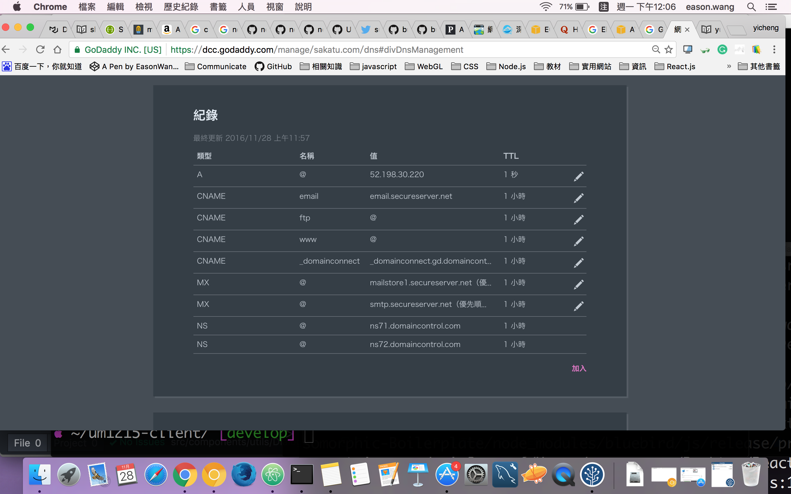

# 域名設定

## 1.以下用AWS EC2 與Goddy為例

致電godaddy後他們的客服都不太能解決問題，一開始我看網路上教導說使用AWS Route53服務，但注意，此不包含在Free tire 需另外收費，但還是稍微講解route53的dns設定，當初參考此篇[https://www.quora.com/How-do-I-route-my-GoDaddy-domain-name-to-my-Amazon-EC2-web-server的第一個回答，但他的回答還少了兩點，就是還要再route53加上兩筆A](https://www.quora.com/How-do-I-route-my-GoDaddy-domain-name-to-my-Amazon-EC2-web-server的第一個回答，但他的回答還少了兩點，就是還要再route53加上兩筆A) record 指向你的example.com和www.example.com，才算完成．

> 但要如何用免費的EC2不用route53指向我們在godaddy買的網域呢？

因為一開始EC2給你的都是浮動的IP也就是你把機器重開後IP位置就會改變，所以我們要先申請Elastic IP，一樣在EC2的console那可申請，之後你的EC2的ssh與public ip會自動改為你新申請好的Elastic IP之後再到Godaddy點選域名伺服器，但注意要選`使用預設名稱伺服器`，之後會發現上面多出一個框框  

之前一直很納悶為什麼都沒有出現這個，直到我把`域名伺服器`選項從自訂改為預設後才出現，之後就把A記錄改為你的EC2 IP 然後再把CNAME 的 WWW改為 你的域名即可，  
即為`@`

