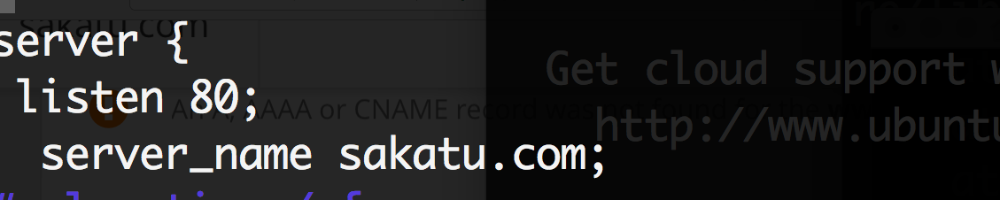

# subdomain，清除DNS快取

## cloudflare設定


nginx config


## 預設domain

這樣子輸入sakatu.com即可另外到一個網站，有時要等一下才會生效，而www則跟上面subdomain設法一樣，但要等一下，有時不行可能是瀏覽器快取，換個瀏覽器試試 



## 清除快取

如果改完沒反應可先去chrome的設定清空瀏覽資料\(時間記得設全部\) `cmd+shift+del` 

如果清完後輸入網址還是無法，可以清空電腦dns

\(For mac\)

```text
sudo killall -HUP mDNSResponder
```

[http://osxdaily.com/2008/03/21/how-to-flush-your-dns-cache-in-mac-os-x/](http://osxdaily.com/2008/03/21/how-to-flush-your-dns-cache-in-mac-os-x/)

\(For windows\)

```text
ipconfig / flushdns
```

[http://zh-cn.affdu.com/how-to-fix-err-name-not-resolved-server-could-not-be-found-error.html](http://zh-cn.affdu.com/how-to-fix-err-name-not-resolved-server-could-not-be-found-error.html)

