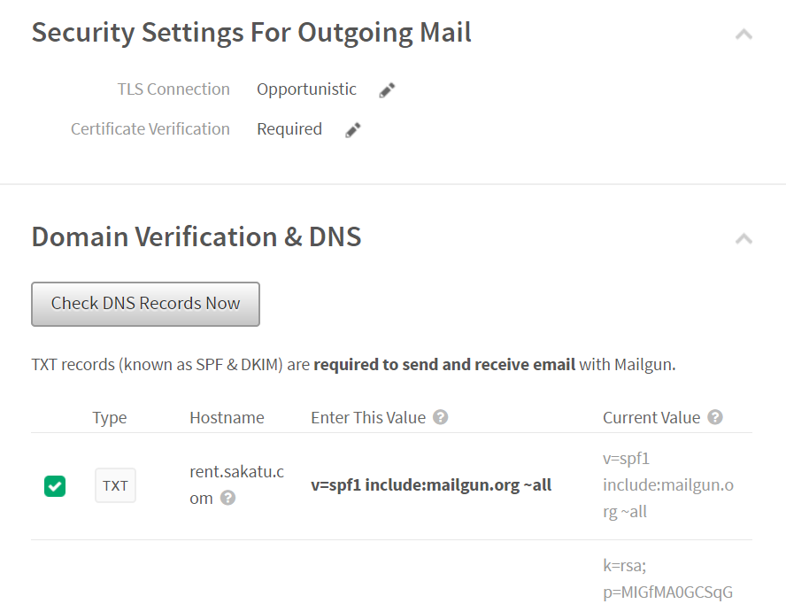
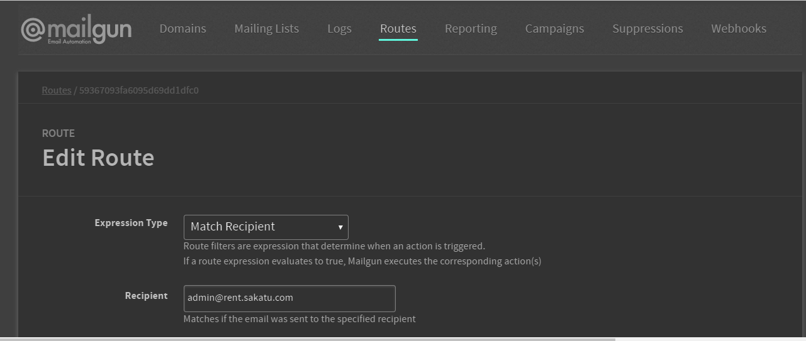
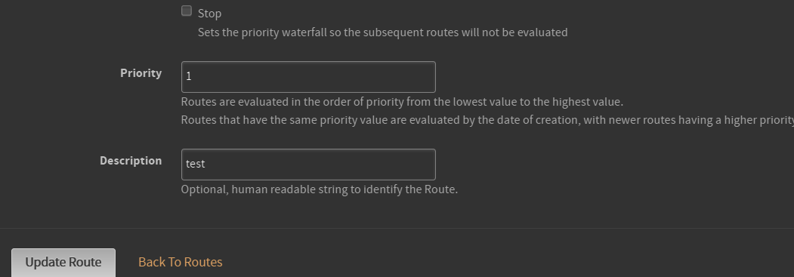

# mailgun

[https://www.mailgun.com/](https://www.mailgun.com)

到網站照著步驟加入MX與TXT


然後按下下圖按鈕即可認證



最下面cname部分之前試都無法認證，還需要研究一下，但不影響發送郵件

\#避免垃圾郵件

1.domain跟發送郵件的from要相同

2.郵件內容跟主題要有內容

3.提供unsubscribe按鈕

4.確認有加入DKIM與SPF

## #接收郵件

先點選Route，然後設定要將你的domain接收的郵件導向哪個信箱



然後設定

之後寫信給 `admin@rent.sakatu.com`

### 使用API發送郵件

這邊使用的是`mailgun-js`

```javascript
var api_key = "key-0000680b76ae7850b195bddb0b37a16a";
var domain = 'mail.sakatu.com';

exports.mailgun = require('mailgun-js')({apiKey: api_key, domain: domain});
```

寄送

```javascript
var data = {
   from: 'Hello <no-reply@mail.sakatu.com>',
   to: req.body.email,
   subject: 'test',
   html: `content`
};
mailgun.messages().send(data, function (error, body) {
  if(err) console.log(err);
  console.log(body);
}
```

> 1.可以點選Mailgun網站上的Domains Tab中的Domain Information即可看到API key。
>
> 2.可以點選Mailgun網站上的Logs Tab查看是否發送成功。
>
> 之前發送給Gmail失敗出現`Free accounts are for test purposes only. Please upgrade or add the address to authorized recipients in Account Settings.` 訊息，之後加入信用卡後就發送成功了(剛加完寄送大約到等五分鐘才到)。
>
> 3.目前Hotmail會進入垃圾信箱。
>
> 4.目前Route設定hotmail信箱可能會產生以下錯誤。
>
> ```
> Please contact your Internet service provider since part of their network is on our block list (AS3140)
> ```
